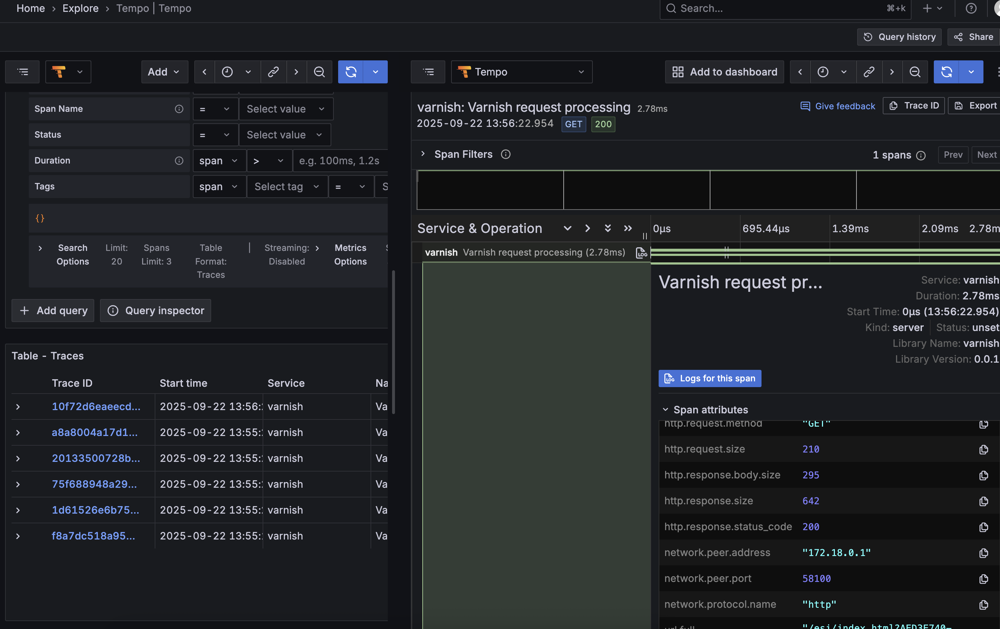

# Quick Start

This document describes how to deploy `varnishotel` locally or from released artifacts. 

## Deploy locally

To run `varnishotel` on your local machine, a quickstart setup is already provided that contains
a `docker compose` configuration including:

- Varnish
- Varnish OTEL exporter
- Grafana LGTM stack (Grafana, Tempo OTEL receiver)
- Test backend based on NGINX 

To run the setup, execute `docker compose up` and wait for containers to be built 
and pulled. 

Afterward, you can open `http://localhost:18080/esi/index.html` in your browser to receive 
a full web page. 

### Varnish

The Varnish instance is configured from the `contrib/varnish/default.vcl` and already includes
support for Edge-Side Includes (ESI) and has a default backend. The backend is set by the `VARNISH_BACKEND_{HOST,PORT}`
environment variables. 

### LGTM Stack

This component contains Grafana and Tempo. Grafana is available at `http://localhost:3000`. To view
traces go to **Explore** and select the Tempo data source:



### NGINX

NGINX is used as a test backend for Varnish and serves a web page composed of ESI includes for full end-to-end
demonstration of a potential real-world backend website. 

### Varnishotel

If you want to run `varnishotel` via `cargo run` or from a prebuilt binary, remove the `varnishotel` container
from the `compose.yaml` file and run

```
export OTEL_EXPORTER_OTLP_ENDPOINT=http://localhost:4317
export PATH="integration/bin:$PATH"
cargo run -- 
```

The `integration/bin` directory contains wrappers for executing `varnishlogjson` and `varnishstat`. 

## Deploy Docker image

First, ensure you have a running Varnish instance. Take note of the `-n` flag in the Varnish process
(by default, this is `/var/lib/varnish/varnishd`) as `varnishotel` needs access to it to read the VSM. 

To run the released Docker image, run

```
docker run --rm \
    --name varnishotel \
    -v <path-to-varlibvarish>:/var/lib/varnish/varnishd \
    -e OTEL_EXPORTER_OTLP_ENDPOINT=<your-otel-collector> \
    -it ghcr.io/thomasklinger1234/varnishotel:edge
```